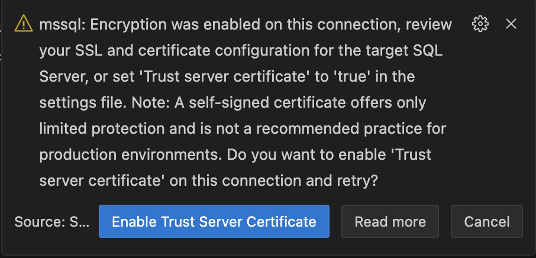

This template references an image that was [pre-built](https://containers.dev/implementors/reference/#prebuilding) to automatically include needed devcontainer.json metadata.

* **Image**: mcr.microsoft.com/devcontainers/dotnet ([source](https://github.com/devcontainers/images/tree/main/src/dotnet))
* **Applies devcontainer.json contents from image**: Yes ([source](https://github.com/devcontainers/images/blob/main/src/dotnet/.devcontainer/devcontainer.json))

## Using this template

This template creates two containers: Python and MS SQL Server. After running the template, Python container will be the main connected development container and from within that container the MS SQL Server container will be available on **`db`** port 1433. By default, the `sa` user password is `P@ssw0rd`. All database parameters may be changed in `.devcontainer/docker-compose.yml` file if desired.

You also can connect to MS SQL Server from an external tool when connected to the Dev Container from a local tool by updating `.devcontainer/devcontainer.json` as follows:

```json
"forwardPorts": [ "1432" ]
```

You can also easily use the [SQL Server extension](https://marketplace.visualstudio.com/items?itemName=ms-mssql.mssql) to connect to the database or any Azure databases from VS Code.

Once the MS SQL Server container has port forwarding enabled, it will be accessible from the Host machine at `localhost:1433`.

### Adding other services

You can add other services to your `.devcontainer/docker-compose.yml` file [as described in Docker's documentation](https://docs.docker.com/compose/compose-file/#service-configuration-reference). However, if you want anything running in this service to be available in the container on localhost, or want to forward the service locally, be sure to add this line to the service config:

```yaml
# Runs the service on the same network as the database container, allows "forwardPorts" in devcontainer.json function.
network_mode: service:db
```

### Steps to connect to local MS SQL Server

Before start working with MS SQL Server locally, you will need to connect to the local MS SQL Server instance using MS SQL Server extension.
Use **`db`** as a server name and **`sa`** as a user name. The password is **`P@ssw0rd`** by default. Once entered the password, you will be prompted to enable trust server certificate as below:

