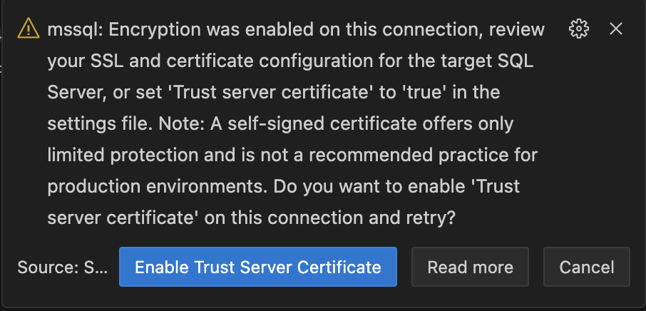

# Python and MS SQL Server (Python-mssql)

Develop Python based applications with all required components to interact with MS SQL Server locally and in Azure. Includes all needed SDKs, extensions, dependencies and an MS SQL container for parallel database development. Adds an additional MS SQL container to Python container definition and deploys any .dacpac files from the mssql .devcontainer folder.

## Options

| Options Id | Description | Type | Default Value |
|-----|-----|-----|-----|
| imageVariant | Python version: | string | 3.11-bullseye |

This template references an image that was [pre-built](https://containers.dev/implementors/reference/#prebuilding) to automatically include needed devcontainer.json metadata.

* **Images**: mcr.microsoft.com/azure-sql-edge && mcr.microsoft.com/vscode/devcontainers/python
* **Applies devcontainer.json contents from image**: Yes ([source](https://github.com/Azure-Samples//blob/main/src/python-mssql/.devcontainer/devcontainer.json))

## Using this template

This template creates two containers: Python and Microsoft SQL Server. You will be connected to the Ubuntu or Debian container, and from within that container the MS SQL container will be available on **`localhost`** port 1433. The Python container also includes supporting scripts in the `.devcontainer/mssql` folder used to configure the database. 

The MS SQL container is deployed from the latest developer edition of Microsoft SQL 2022. The database(s) are made available directly in the Codespace/VS Code through the MSSQL extension with a connection labeled "db-data-model".  The default `sa` user password is set to `P@ssw0rd`. The default SQL port is mapped to port `1433` in `.devcontainer/docker-compose.yml`.

#### Changing the sa password

To change the `sa` user password, change the value in `.devcontainer/docker-compose.yml` and `.devcontainer/devcontainer.json`.

#### Database deployment

By default, a blank user database is created titled "ApplicationDB".  To add additional database objects or data through T-SQL during Codespace configuration, edit the file `.devcontainer/mssql/setup.sql` or place additional `.sql` files in the `.devcontainer/mssql/` folder. *Large numbers of scripts may take a few minutes following container creation to complete, even when the SQL server is available the database(s) may not be available yet.*

Alternatively, .dacpac files placed in the `./bin/Debug` folder will be published as databases in the container during Codespace configuration. [SqlPackage](https://docs.microsoft.com/sql/tools/sqlpackage) is used to deploy a database schema from a data-tier application file (dacpac), allowing you to bring your application's database structures into the dev container easily. *The publish process may take a few minutes following container creation to complete, even when the server is available the database(s) may not be available yet.*

### Adding other services

You can add other services to your `.devcontainer/docker-compose.yml` file [as described in Docker's documentation](https://docs.docker.com/compose/compose-file/#service-configuration-reference). However, if you want anything running in this service to be available in the container on localhost, or want to forward the service locally, be sure to add this line to the service config:

```yaml
# Runs the service on the same network as the database container, allows "forwardPorts" in devcontainer.json function.
network_mode: service:db
```

### Steps to connect to local MS SQL Server

Before start working with MS SQL Server locally, you will need to connect to the local MS SQL Server instance using MS SQL Server extension.
Use **`db`** as a server name and **`sa`** as a user name. The password is **`P@ssw0rd`** by default. Once entered the password, you will be prompted to enable trust server certificate as below:

